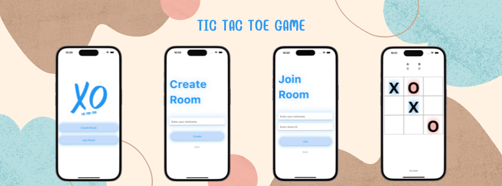

# Multiplayer TicTacToe Game

A completely Responsive Multiplayer TicTacToe Game- Works on Android, iOS, Web & Desktop! 

## Features
1. Create/Join Room
2. Play Realtime
3. Display Points
4. Round & Game Winner
5. Responsive Glow Themed UI
6. Cross Platform Game

## Tech Used
**Server**: Node.js, Express, Socket.io, Mongoose, MongoDB

**Client**: Flutter, Provider
